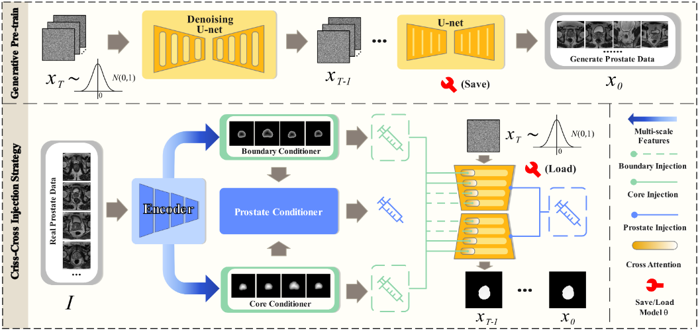
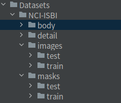

**# CriDiff
> The official implement of MICCAI 2024 paper [CriDiff: Criss-cross Injection Diffusion Framework via Generative Pre-train for Prostate Segmentation.](https://arxiv.org/abs/2406.14186)

# Environment Installation
```
conda create -n CriDiff python=3.8 -y
conda activate CriDiff
git clone https://github.com/LiuTingWed/CriDiff.git
cd CriDiff
pip install -r requirements.txt
```
## Datasets Preparation
### Download Datasets
4 datasets need download (NCI-ISBI, ProstateX, Promise12, CCH-TRUSPS) from:
\
[Google Driver](https://drive.google.com/file/d/1riv-XTmlrcI_VHFJ_a18LdKGogTKH8Za/view?usp=drive_link) | [Baidu Driver]()
\
**I'm not sure about the copyright status of these datasets. If you are the owner of these datasets, please submit an issue to let me know so that I can remove them accordingly.**
#### Check data branch like this:

\
The body and detail are generated by **extract_boundary/generate_body_detail.py.** 
\
Please check this **.py** for more details.

## Download Pre-train Weight
[Google Driver](https://drive.google.com/file/d/1snw4TYUCD5z4d3aaId1iBdw-yUKjRmPC/view)
## Training & Inference & Evaluation

